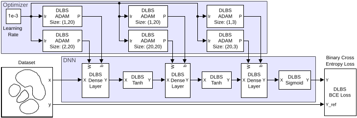

# Deep Learning Block-Set
The blockset provides a basic set of Simulink blocks for building deep learning models. 



The Deep Learning Block-Set (DLBS) aims to make deep learning model design, training, and deployment possible directly in Simulink using modular subsystem blocks.
DLBS combines tensor operations, layers, nonlinear activations, loss functions, optimizers, and routing utilities so models can be built graphically and trained in natively in Simnulink.

DLBS is intended for educational use, rapid prototyping, and workflows that benefit from Simulink-native model composition and code generation tooling.
For a first hands-on model, start with the peak-classification example in the Getting Started page.


## Citing
If you use this blockset in your research, please cite the following paper:
```
A. Oerder et al., "Deep Learning Block-Set - A Simulink Native Deep Learning Framework", 2026 International Power Electronics Conference (IPEC-Nagasaki 2026 - ECCE Asia), https://doi.org/10.23919/IPEC-Nagasaki2026-EC64663.2026.11597096
```

## License
Copyright (c) Karlsruhe Institute of Technology (KIT).

This blockset is licensed under the MIT License. See the [LICENSE.txt](LICENSE.txt) file for more details.


## Development Repository

The [GitHub repository KIT-ETI/Deep-Learning-Block-Set](https://github.com/KIT-ETI/Deep-Learning-Block-Set) constitutes the development version of the blockset. If you are looking for the installable toolbox, visit [Mathworks Exchange](https://mathworks.com/matlabcentral/fileexchange/183974-deep-learning-block-set).


### Structure of the Repository

```
deep-learning-block-set/
├── +dlbs/                      # Tooling for packaging and testing the toolbox
├── docs/                       # General documentation of the toolbox
├── toolbox/
│   ├── examples/
│   │   └── dlbsExamplePeakClassification
│   ├── library/
│   │   ├── **/                 # Implementaion of block of the library
│   │   ├── slblock.m
│   │   └── dlbs.slx
│   ├── dlbsAbstractHarnessTest.m
│   ├── dlbsHelpPageTemplate.m
│   └── info.xml
└── README.md
```
Each block implementation should adhere the the following folder structure, examplary for `tanh`:

```
tanh/
├── dlbsBlockTanh.slx           # Simulink Library implementing a single block, which is reference by dlbs.slx
├── dlbsHelpBlockTanh.m         # Documentation if this block, which returns an object of "dlbsHelpPageTemplate"
└── test
    ├── dlbsTestHarnessTanh.slx # Provide a harness applying constant inputs to the block to test
    └── dlbsTestTanh.m          # Testclass, inherting dlbsAbstractHarnessTest
```

### Development

This block set was developed using _MATLAB R2025b_. It uses the python-integration for behavioural testing against PyTorch. _MATLAB R2025b_ does not support python versions newer than 3.12. 

To add the development version of the toolbox to the MATLAB path run:
```matlab
dlbs.initPath();
```

For running tests you also need to create a virtual environment in the current folder with the given requirements. This can be done using

```matlab
dlbs.createPyVenv();
dlbs.activatePyVenv();
```

Developing new blocks should be in line with the given folder structure. Then the steps needed to create a new block are:
1. Implement a new block, preferably by reusing other math blocks already provided in this library.
1. Optimize where appropriate 
1. Write a `delbsHelp*.m` and add it to `docs/helptoc.xml`
1. Add a unit test.
1. Add the block to the main library `toolbox/library/dlbs.slx`

### Packing the toolbox

To pack the toolbox run:
```matlab
version = "0.0.0";
runTests = true";
buildDocuments = true;
package = true;
outputFolder = "";
dlbs.packageToolbox(version, ...
    runTests=runTests, ...
    buildDocumentation=buildDocumentation, ...
    package=package, ...
    outputFolder=outputFolder, ...
    );
```

Be aware that the toolbox UUID as well as the author infomation is hardcoded in `+dlbs/packageToolbox.m` and need to be changed when forking the repository.

## Further Notes
The documentation consisting of  `dlbsHelp*.m` files as well as scripts in `+dlbs/+helpers/` were written using AI-tooling using _GPT 5.3-Codex_.

This project is not associated with MathWorks™.

## Copyright notices
- MathWorks™, MATLAB®, Simulink®, Embedded Coder®, HDL Coder™ and Deep Learning Toolbox™ are registered trademarks of The MathWorks, Inc. 
- PyTorch is a registered trademark of The Linux Foundation.